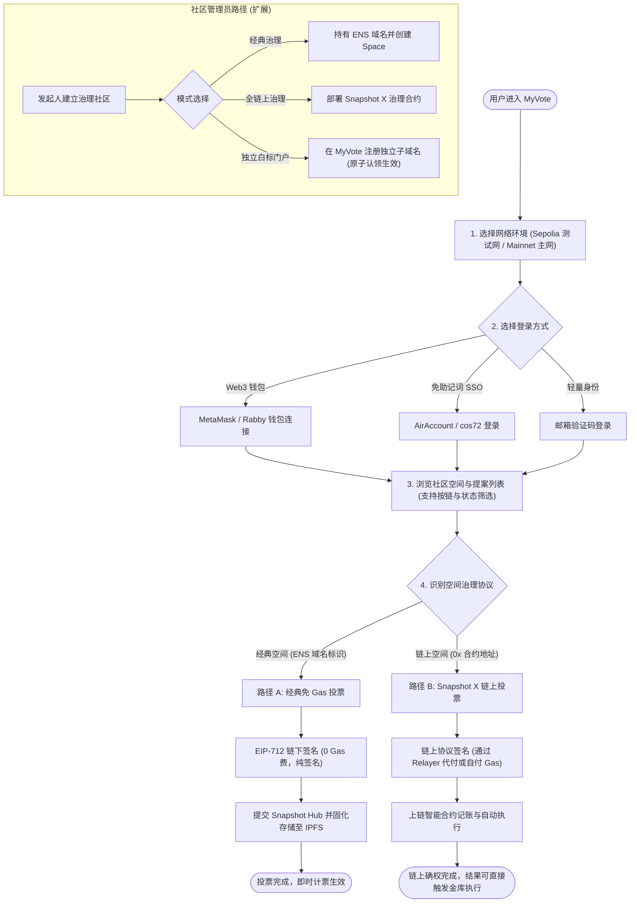

# MyVote

[](https://opensource.org/licenses/Apache-2.0)

A white-label governance portal for any community. **Classic Snapshot (off-chain) by default, with optional on-chain [Snapshot X](https://docs.snapshot.box/snapshot-x/overview) support** through the same UI.

---

## What it does

- **Explore → Space → Proposal** pages, with results, Markdown proposal bodies and a voting form.
- **Two vote backends behind one seam:**
  - *Default* — classic off-chain Snapshot Hub: gasless EIP-712 signatures, fully interoperable with [snapshot.box](https://snapshot.box).
  - *Optional* — Snapshot X on-chain spaces (EVM, incl. **Optimism**): votes are signed and relayed gaslessly through Mana.
  - Routing is automatic: `0x…` spaces are on-chain, ENS names are off-chain (see `src/lib/voteRouting.ts`).
- **Pluggable login** via an `AuthProvider` interface:
  - `wallet` — any EIP-1193 wallet (MetaMask, …);
  - `airaccount` — cos72 SSO + remote KMS signing *(blocked on external services)*;
  - `email` — interim lightweight identity.
- **Multi-tenant white-label**: one deployment serves many communities, each on its own subdomain with its own branding (hostname → Cloudflare KV → `window.__TENANT__`).
- **zh-CN by default**, English fallback.
- **Cloudflare Pages Functions** at the edge for tenant resolution, self-service subdomain registration, and a `/api/graphql` proxy for connectivity.

> Design rationale for the classic-vs-new choice is recorded in [`docs/snapshot-version-decision.md`](./docs/snapshot-version-decision.md).

---

## Trust & Technical Foundations / 信任与技术底座

为了让用户与社区管理者清晰了解资金与治理安全，以下是 MyVote 的工作原理与技术底座说明：

### 1. MyVote 的定位是什么？
- **非官方的开源轻量级集成客户端**：MyVote 不托管任何用户私钥，不拥有资金池，也不改变底层协议的执行逻辑。
- **双引擎二合一**：将「Snapshot 经典链下验签」与「Snapshot X 纯链上治理」统一合并到同一个轻量 Organic 界面中，并对多链切换与账户抽象（AA）做了交互层优化。代码完全开源透明。

### 2. Snapshot（经典版）存在 IPFS 上，谁负责掏钱 Pin？数据会丢失吗？
- **数据存储形态**：经典版 Snapshot 不上以太坊主链（因此完全免 Gas 费），所有提案与投票均由用户私钥生成 **EIP-712 密码学签名**，并生成不可篡改的 **IPFS CID 哈希**。
- **谁在出钱 Pin（固化）？**：由 **Snapshot Labs 官方团队** 及其合作的基础设施提供商（如 Filecoin 基金会、Pinata、4EVERLAND 等）统一承担 Pinning 节点集群费用，保证全球长久可用。
- **容灾与不可篡改性**：因为每次投票都有确定性的密码学签名与 IPFS CID，即使 Snapshot 官方服务器故障，任何社区或个人也可以自行镜像 Pin 这些 CID，并基于签名数据与当时链上区块高度离线独立验签、计票。

### 3. Snapshot X 的合约是谁写的？可信吗？被审计过吗？
- **合约开发者**：由 **Snapshot Labs 官方核心团队** 原生开发，旨在提供免信任、免中心化中继器的全链上执行治理。
- **安全审计**：Snapshot X 核心合约矩阵（EVM 及 Starknet 架构）已经由顶尖安全审计机构（包括 **ABDK Consulting** 与 **Nethermind** 等）完成全套安全审计，代码全部开源经过社区严格检验。

### 4. 我们可以自定义合约吗？
- **完全支持！** Snapshot X 采用高扩展的「乐高积木」模块化架构：
  - **投票策略合约（Voting Strategies）**：可自定义编写支持任意规则（如 ERC20 余额、NFT 权重、加权抵押等）的策略合约；
  - **执行合约（Execution Strategies）**：可自由绑定时间锁（Timelock）或 Zodiac / Gnosis Safe 多签执行模块，提案通过后**由智能合约自动触发链上金库转账或合约升级**；
  - **验证器合约（Authenticators）**：支持签名、交易自付或 Relayer 代付验证。

---

## User Lifecycle / 用户全生命周期



---

## Status

| Milestone | State |
|---|---|
| M1 Clone & Deploy (branding, pages, off-chain voting, i18n) | ✅ |
| M2 Multi-tenant (KV + edge injection + self-service registration) | ✅ |
| M3 Multi-backend write path, race guard, cache scoping, error i18n | ✅ |
| M4 AirAccount login | ⏸ MyVote side done (KMS signer + verified live signature); waiting on cos72 credentials — see `docs/cos72-airaccount-requirements.md` |
| M5 Snapshot X (EVM/OP): backend, read path, pages, results | ✅ (real Sepolia testnet vote cast 2026-09-24; public Mana has no Sepolia gas) |
| M5.5 Sepolia testnet community E2E: ENSv2 name → space → proposal → real votes | ✅ |
| M6 Registration hardening: rate limit, ownership proof, email code, atomic name claim (DO) | ✅ |

Full roadmap: [`docs/Plan.md`](./docs/Plan.md).

---

## Quick start

```bash
cd apps/web
pnpm install
pnpm run dev -- --host 0.0.0.0 --port 5173   # or: ./run.sh from the repo root
```

Open http://localhost:5173 — `/` redirects to `/explore`.

```bash
pnpm run build       # vue-tsc typecheck + vite build
pnpm run test        # Vitest (unit tests next to the code)
pnpm run typecheck
```

> If `pnpm` refuses to touch `node_modules` in a non-TTY shell, run the local binaries directly: `./node_modules/.bin/vitest run`.

### Try an on-chain space

On `/explore`, paste a Snapshot X space address into **Open an on-chain space** (e.g. the Optimism space `0x03C7431e14F7b759Aa44398AD7901e6053c197Bf`).

---

## Configuration

Copy `apps/web/.env.example` to `apps/web/.env.local` and override as needed.

| Variable | Default | Purpose |
|---|---|---|
| `VITE_SNAPSHOT_HUB` | `https://testnet.hub.snapshot.org` | Off-chain Hub (set to `https://hub.snapshot.org` for mainnet spaces) |
| `VITE_SNAPSHOT_GRAPHQL_ENDPOINT` | `${VITE_SNAPSHOT_HUB}/graphql` | Read endpoint (may point at the `/api/graphql` edge proxy) |
| `VITE_SNAPSHOT_APP_NAME` | `myvote` | App id sent with votes |
| `VITE_SX_API` | `https://api.snapshot.box` | Snapshot X indexer |
| `VITE_REGISTER_ROOT_DOMAIN` | `forest.mushroom.cv` | Root domain for community subdomains (must match the edge's `CF_ROOT_DOMAIN`) |
| `VITE_COS72_API` | *(empty)* | AirAccount SSO origin |
| `VITE_COS72_AUTHORIZE_URL` | `${VITE_COS72_API}/sso/start` | cos72 SSO start page |
| `VITE_SSO_CALLBACK_PATH` | `/sso/callback` | The one path cos72 may redirect back to |
| `VITE_SSO_ONLY` | `false` | AirAccount-only deployment |

The default is the **testnet** Hub because the space this repo targets lives on Sepolia; a testnet space does not exist on the mainnet hub.

### Branding a community

Edit [`apps/web/src/branding.ts`](./apps/web/src/branding.ts) (name, logo, colors, links) for a single deployment, or a tenant's KV record for per-host overrides.

---

## Deployment

Cloudflare Pages, one project, two environments:

- `main` → **production** (production KV);
- any other branch → **preview** (preview KV).

```bash
apps/web/scripts/deploy-preview.sh dev        # preview (uses the preview KV namespace)
```

> A bare `wrangler pages deploy --branch dev` repoints the project's *preview* KV binding at **production data**. Always use the script — full context in [`docs/deployment.md`](./docs/deployment.md).

---

## Architecture

Vue 3 + TypeScript + Vite, no state-management library. All backend access is external (Snapshot Hub GraphQL, the Snapshot X indexer, and Cloudflare Pages Functions). See [`CLAUDE.md`](./CLAUDE.md) for the layer map, data flow and key decisions.

Handy entry points:

- `src/lib/snapshotVote.ts` — hand-rolled off-chain EIP-712 vote envelope (no `snapshot.js`, no ethers).
- `src/lib/sx/` — Snapshot X backend (lazy-loaded SDK), read path and EIP-1193 provider adapter.
- `src/lib/errors.ts` — stable error codes translated in the UI.
- `functions/` — edge tenant resolution, registration, and the GraphQL proxy.

---

## Documentation

- [`docs/Plan.md`](./docs/Plan.md) — roadmap
- [`docs/snapshot-version-decision.md`](./docs/snapshot-version-decision.md) — classic vs new stack
- [`docs/snapshot-x-integration.md`](./docs/snapshot-x-integration.md) — Snapshot X (on-chain) integration guide
- [`docs/testnet-space-e2e.md`](./docs/testnet-space-e2e.md) — Sepolia testnet space end-to-end (ENSv2 quirks, reproducible steps)
- [`docs/sx-testnet.md`](./docs/sx-testnet.md) — Snapshot X testnet map + verified Sepolia on-chain vote
- [`docs/registration-atomicity.md`](./docs/registration-atomicity.md) — registration name claim via Durable Objects
- [`docs/cos72-airaccount-requirements.md`](./docs/cos72-airaccount-requirements.md) — interface requests for cos72 / AirAccount (M4)
- [`docs/deployment.md`](./docs/deployment.md) — environments, KV namespaces, secrets, runbook
- [`docs/M1-clone-deploy.md`](./docs/M1-clone-deploy.md) — clone & deploy for a new community
- [`docs/M2-multi-tenant.md`](./docs/M2-multi-tenant.md) — multi-tenancy
- [`docs/architecture-review.md`](./docs/architecture-review.md) — tech-debt review
- [`docs/development-loop.md`](./docs/development-loop.md) — dev loop & pre-PR check
- [`docs/check-list.md`](./docs/check-list.md) — step-by-step feature checklist for new staff
- [`docs/SnapshotX.md`](./docs/SnapshotX.md) — historical Snapshot X research (partly outdated)

---

## License

This project is licensed under the [Apache License, Version 2.0](LICENSE).
Copyright 2024-present MushroomDAO Contributors.
See [NOTICE](./NOTICE) · [TRADEMARK.md](./TRADEMARK.md) · [LICENSE-zh.md](./LICENSE-zh.md) · [TRADEMARK-zh.md](./TRADEMARK-zh.md) for details.
